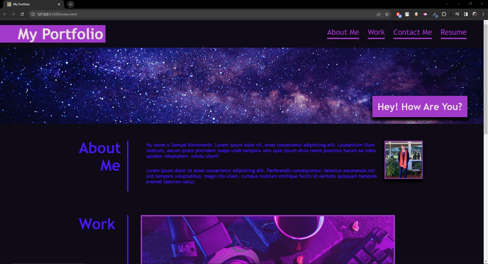
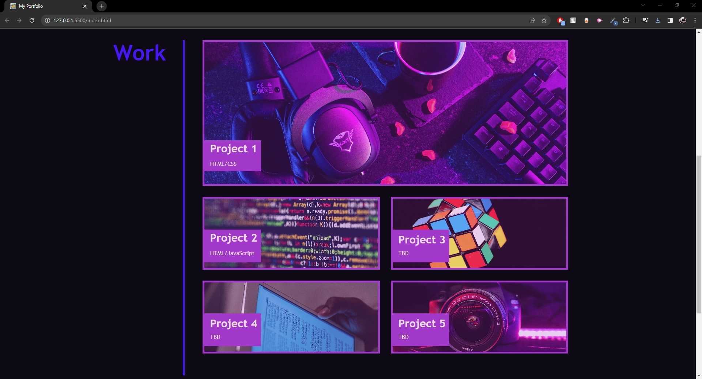
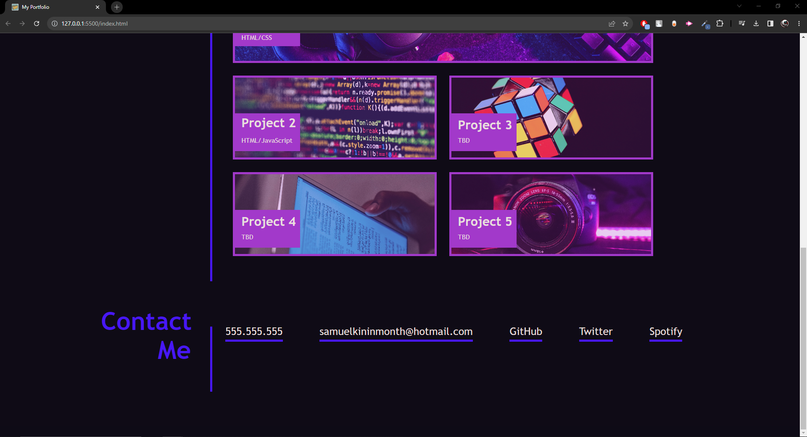

# portfolio

## Description

The reason behind making this project was to make a website that I can use as my own personal portfolio throughout my career.

I would like to use it and improve upon it further so that businesses have an easy way to learn more about me, see my previous projects, contact me easier and also gain access to my resume easier. 

Creating this website gives access to all these things in the one place using a very easy to use and view design layout.

I learned a lot creating this website, it helped improve my HTML and CSS skills drastically and taught me about tonnes of new features that I didn't know of and helped me improve upon features that I already did know of.

## Usage

Using the website is quite simple, a description will be provided of how to do so.

Link to deployed webpage: 
https://duragmyreligion.github.io/portfolio/

Features:

1. Left clicking on 'About Me' in the top navigation bar moves you to the 'About Me' section of the website and displays information about this topic.

2. Left clicking on 'Work' in the top navigation bar moves you to the 'Work' section of the website and displays information about this topic.

3. Left clicking on 'Contact Me' in the top navigation bar moves you to the 'Contact Me' section of the website and displays information about this topic.

4. Left clicking on any of the projects in the work section will bring you to the specified project, unfortunately none are available at this time.

5. Left clicking on any of the links in the 'Contact Me' section on the bottom navigation bar will take you to those forms of contact, unfortunately only some are available at this time.
